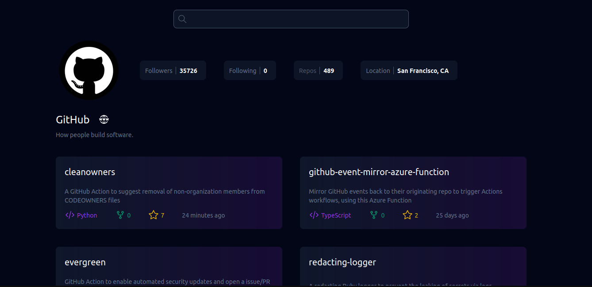

# Un app para ver perfiles de github

La pagina web [Aquí](https://angelito91.github.io/gh-profile)




## 🛠 Instalar
- Debes tener `pnpm` instalado

- Descargar el repositorio
    ```
    git clone https://github.com/Angelito91/gh-profile.git
    ```
- Instalar las dependencias
    ```
    pnpm install
    ```
- Ejecuta
    ```
    pnpm run dev
    ```

### 📌 Tecnologías
- Svelte 💊
- Tailwindcss ⭐
- Api Github 💡